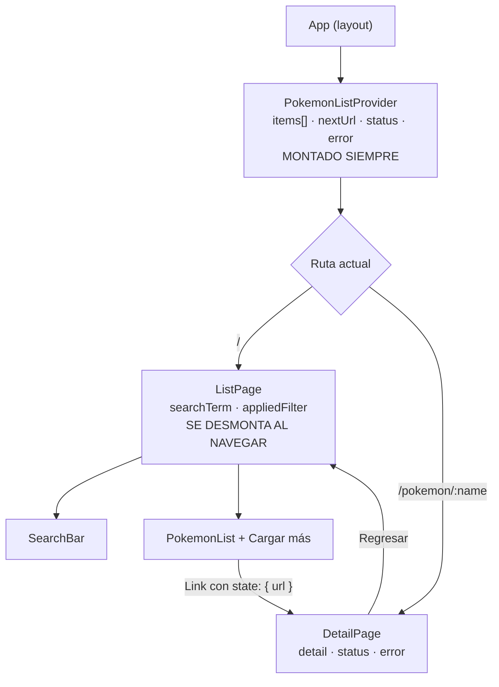
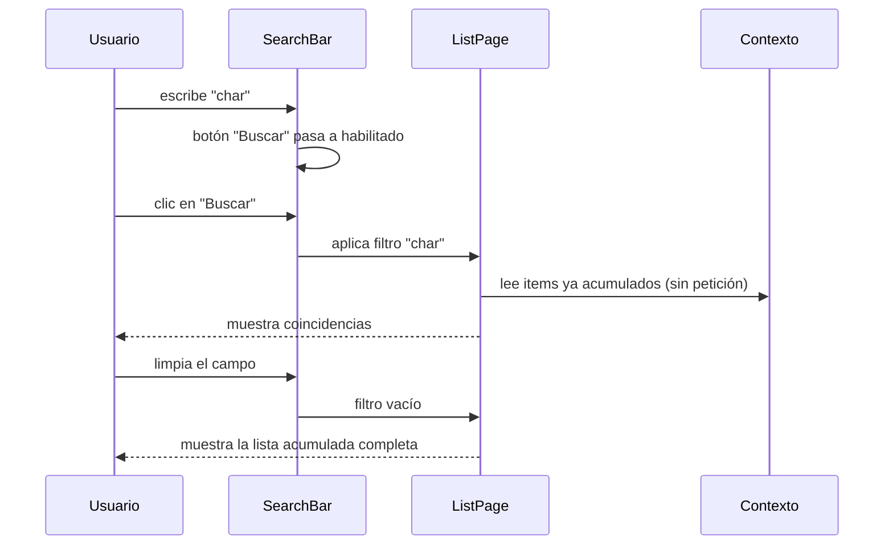
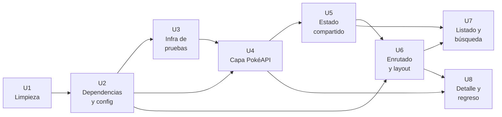

# feat: Listado, búsqueda y detalle de Pokémon (WOR-8)

> **Raíz del proyecto:** todas las rutas de este plan son relativas a `pokemon-api/` (donde vive `package.json`). El repositorio git está una carpeta más arriba, en `pokemon-api-test/`.

## Summary

Se parte del andamiaje de la plantilla de Vite y se lo convierte en la aplicación de WOR-8: se elimina la demo, se instalan y configuran React Router 8, Axios, Tailwind 4 y el stack de pruebas (Vitest 5 + React Testing Library + MSW) con umbral de cobertura, y sobre esa base se construyen las cuatro conductas del ticket — listado paginado acumulativo desde PokéAPI, búsqueda local sobre lo ya descargado, vista de detalle con los cinco campos exigidos y regreso al listado conservando lo acumulado. Cada unidad con conducta propia trae sus pruebas unitarias; no hay una fase de "testing" al final.

---

## Problem Frame

El repositorio está recién inicializado y no tiene ni un solo commit: es la plantilla `react-ts` de Vite sin tocar, con una página de demostración, assets de marca de Vite/React y un README genérico. No hay enrutador, ni cliente HTTP, ni framework de estilos, ni infraestructura de pruebas.

WOR-8 pide una aplicación que consuma PokéAPI para listar Pokémon, filtrarlos localmente y mostrar su detalle. Todo — desde el borrado del andamiaje hasta la última prueba — es trabajo nuevo, y la única fuente de verdad de conducta es el ticket.

---

## Requirements

- **R1.** La aplicación obtiene los Pokémon desde `https://pokeapi.co/api/v2/pokemon` y muestra la lista resultante al usuario.
- **R2.** Cada Pokémon del listado es seleccionable.
- **R3.** La carga es paginada de 20 en 20 mediante un control "Cargar más" que **acumula** resultados en lugar de reemplazarlos.
- **R4.** La vista de listado tiene un campo de búsqueda y un botón "Buscar".
- **R5.** El botón "Buscar" está deshabilitado cuando el campo está vacío y se habilita cuando el usuario escribe.
- **R6.** Al pulsar "Buscar" se filtran **los Pokémon ya acumulados en memoria**, sin realizar ninguna petición nueva a la API.
- **R7.** La búsqueda encuentra nombres que coinciden exactamente con el texto **y** nombres que lo contienen (`char` → `charmander`).
- **R8.** Si el usuario limpia el campo de búsqueda, vuelve a mostrarse la lista original acumulada.
- **R9.** Al seleccionar un Pokémon se consulta su información detallada usando el endpoint que la propia API entrega para ese recurso.
- **R10.** Al mostrarse el detalle, el listado queda oculto.
- **R11.** El detalle muestra como mínimo: `name` (Nombre), `sprites.front_default` (Imagen), `height` (Altura), `weight` (Peso) y `abilities` (Habilidades).
- **R12.** La vista de detalle tiene un botón "Regresar" que cierra el detalle y vuelve a mostrar el listado junto con sus opciones de búsqueda.
- **R13.** El botón "Regresar" aparece **únicamente** en la vista de detalle.
- **R14.** Al regresar del detalle se conserva lo que el usuario ya había acumulado en el listado y el filtro de búsqueda queda limpio.
- **R15.** El repositorio queda libre de los archivos de andamiaje de la plantilla que no se usen.
- **R16.** Las unidades con conducta propia tienen pruebas unitarias y el proyecto exige un mínimo de cobertura del 80%.

---

## Scope Boundaries

- No se implementa despliegue ni integración continua (GitHub Actions u otro).
- No se escriben pruebas end-to-end ni de navegador real (Playwright, Cypress).
- No se añade documentación de producto; el README queda reducido a un mínimo operativo (nombre y scripts).
- No se implementan funcionalidades de PokéAPI que el ticket no pide: tipos, estadísticas, cadenas de evolución, favoritos, comparador.
- No se muestran sprites en los items del listado — la lista presenta únicamente el nombre.
- No se añade internacionalización ni tema oscuro.
- No se persiste estado entre recargas del navegador (`localStorage`, `sessionStorage`).

---

## Context & Research

### Estado actual del repositorio

- `src/App.tsx` — página de demostración de la plantilla (contador, enlaces a Vite/React/Discord/X/Bluesky). Se reemplaza por completo.
- `src/App.css`, `src/index.css` — estilos de la demo. Se reemplazan por la hoja de entrada de Tailwind.
- `src/assets/hero.png`, `src/assets/react.svg`, `src/assets/vite.svg`, `public/icons.svg` — arte de la plantilla, sin uso futuro.
- `README.md` — README genérico de la plantilla `react-ts`.
- `vite.config.ts` — solo registra `@vitejs/plugin-react`; es el punto donde se añaden el plugin de Tailwind y el bloque `test` de Vitest.
- `tsconfig.app.json` — `include: ["src"]`, `noUnusedLocals`/`noUnusedParameters` activos y `verbatimModuleSyntax: true` (obliga a `import type` para importaciones solo de tipos).
- `.oxlintrc.json` — oxlint con plugins `react`, `typescript`, `oxc`.
- No existen `AGENTS.md`, `CLAUDE.md`, `STRATEGY.md`, `docs/solutions/` ni ningún patrón previo que seguir. Todas las convenciones de este plan son nuevas.

### Contrato de PokéAPI (verificado contra la API en vivo)

Listado — `GET /api/v2/pokemon?limit=20&offset=0`:

| Campo | Forma | Nota |
|---|---|---|
| `count` | `number` | 1351 en el momento de escribir este plan |
| `next` | `string \| null` | URL de la siguiente página; `null` en la última |
| `previous` | `string \| null` | URL de la página anterior |
| `results` | `Array<{ name: string; url: string }>` | **Solo nombre y URL — no trae imágenes** |

Detalle — `GET /api/v2/pokemon/charmander`:

| Campo | Forma | Valor de ejemplo |
|---|---|---|
| `name` | `string` | `"charmander"` |
| `height` | `number` | `6` (decímetros) |
| `weight` | `number` | `85` (hectogramos) |
| `sprites.front_default` | `string \| null` | `"https://raw.githubusercontent.com/PokeAPI/sprites/master/pokemon/4.png"` |
| `abilities` | `Array<{ is_hidden: boolean; slot: number; ability: { name: string; url: string } }>` | `blaze` (slot 1), `solar-power` (oculta, slot 3) |

Dos detalles con consecuencias de diseño: `sprites.front_default` **puede ser `null`** para algunos recursos, y el nombre de la habilidad está anidado en `abilities[].ability.name`, no en `abilities[].name`.

### Versiones vigentes verificadas en npm (14/09/2026)

| Paquete | Versión | Tipo |
|---|---|---|
| `react-router` | 8.3.1 | dependencia |
| `axios` | 1.20.0 | dependencia |
| `tailwindcss` / `@tailwindcss/vite` | 4.3.3 | desarrollo |
| `vitest` / `@vitest/coverage-v8` | 5.0.0 | desarrollo |
| `jsdom` | 30.0.1 | desarrollo |
| `@testing-library/react` | 16.3.3 | desarrollo |
| `@testing-library/dom` | 10.x | desarrollo (peer explícito de RTL) |
| `@testing-library/jest-dom` | 7.0.1 | desarrollo |
| `@testing-library/user-event` | 14.6.7 | desarrollo |
| `msw` | 2.15.0 | desarrollo |

Compatibilidad confirmada con el entorno actual: Node 24.14.0 y npm 11.9.0 locales; React Router 8 exige Node ≥ 22.22, React ≥ 19.2.7 y Vite ≥ 7 (el repo trae React 19.2.8 y Vite 8.3); Vitest 5 acepta Vite ^8; `@tailwindcss/vite` 4.3 acepta Vite ^8.

### Referencias externas

- [React Router v8 — notas de versión](https://remix.run/blog/react-router-v8): builds solo ESM, middleware activo por defecto y, lo más relevante aquí, **el paquete `react-router-dom` desaparece**. Los componentes se importan desde `react-router` y las APIs específicas de DOM desde `react-router/dom`.
- [React Router v8 — discusión de lanzamiento](https://github.com/remix-run/react-router/discussions/14468)
- [PokéAPI — documentación](https://pokeapi.co/docs/v2)

---

## Key Technical Decisions

- **Paginación acumulativa con "Cargar más" en lugar de Anterior/Siguiente**: es la única forma de paginación que hace verdadera la exigencia del ticket de que "Buscar" filtre *los Pokémon que ya fueron obtenidos de la API*. Con navegación por páginas que reemplaza el contenido, buscar `char` estando en la página 3 no encontraría nada.
- **La lista acumulada vive en un contexto de React; el texto de búsqueda vive en el estado local de la vista de listado**: esta separación produce por construcción la conducta pedida al regresar del detalle (R14). El contexto está montado en el layout, sobrevive a la navegación y conserva lo acumulado; la vista de listado se desmonta al ir al detalle, y con ella se va el filtro. No hace falta lógica explícita de "limpiar búsqueda al volver".
- **React Router 8 con rutas reales (`/` y `/pokemon/:name`)** en vez de renderizado condicional: la URL queda compartible y el botón Atrás del navegador funciona. Importaciones desde `react-router`, nunca desde `react-router-dom`, que ya no existe en v8.
- **La URL del detalle se propaga desde el item del listado a través del estado de navegación del enlace**, cumpliendo literalmente R9 ("el endpoint proporcionado por la API"). Cuando ese estado no existe — navegación directa o recarga sobre `/pokemon/charmander` — se reconstruye la URL a partir del parámetro de ruta. Ambos caminos deben quedar cubiertos por pruebas.
- **Axios con una instancia única configurada con `baseURL` y timeout**, en lugar de `fetch` suelto: centraliza el manejo de errores y da un único punto que las pruebas conocen.
- **MSW intercepta a nivel de red, no se mockea el módulo de axios**: las pruebas ejercitan el código real de la capa de API contra respuestas controladas, incluyendo los caminos de error 404 y 500. Mockear `axios` con `vi.mock` dejaría sin probar precisamente la capa que traduce la respuesta.
- **Tailwind 4 vía `@tailwindcss/vite`**: v4 se configura desde el plugin de Vite y una sola directiva de importación en la hoja de estilos; no necesita `tailwind.config.js` ni cadena de PostCSS.
- **Umbral de cobertura del 80% en líneas, funciones, ramas y sentencias**, con el proveedor `v8`, excluyendo el punto de entrada, los manejadores de MSW y los archivos de tipos puros. Por debajo del umbral, la ejecución de pruebas falla.
- **Búsqueda insensible a mayúsculas y con espacios recortados**: el ticket ejemplifica `char` → `charmander` en minúsculas, pero un usuario que escriba `Char` espera el mismo resultado. Es la interpretación que no sorprende a nadie.

---

## Open Questions

### Resueltas durante la planificación

- *¿Cuántos Pokémon carga inicialmente y sobre qué conjunto busca?* → Páginas de 20 con "Cargar más" acumulativo; la búsqueda filtra todo lo acumulado.
- *¿Render condicional o rutas reales?* → React Router 8 con `/` y `/pokemon/:name`.
- *¿Qué librerías externas?* → Axios y Tailwind CSS. Se descartaron explícitamente TanStack Query y Zod.
- *¿Qué stack de pruebas?* → Vitest + React Testing Library + MSW.
- *¿Qué muestra cada item del listado?* → Solo el nombre; sin peticiones adicionales por item.
- *¿Qué encuentra el usuario al regresar del detalle?* → Lo acumulado intacto, con la búsqueda limpia.
- *¿Alcance más allá del código y las pruebas?* → Únicamente el umbral de cobertura. Sin CI, sin README extendido, sin auditoría de accesibilidad.

### Diferidas a la implementación

- Nombres concretos de componentes, hooks y funciones exportadas: se fijan al escribir el código.
- Forma exacta del bloque `test` en `vite.config.ts` y de los tipos globales de Vitest en `tsconfig.app.json`: dependen de lo que exija Vitest 5 al integrarse con Vite 8 en este proyecto.
- Si `@testing-library/dom` necesita instalación explícita o llega resuelto como dependencia transitiva: se confirma al instalar.
- Unidades de presentación de `height` y `weight`: la API las entrega en decímetros y hectogramos. Mostrarlas convertidas a metros y kilogramos es más honesto para el usuario, pero es una decisión de presentación que el ticket deja "a criterio del candidato" y se cierra al construir la vista.
- Si `oxlint` requiere ajustes de configuración para los archivos de prueba.

---

## Output Structure

    pokemon-api/
    ├── src/
    │   ├── api/
    │   │   ├── client.ts                    # instancia de axios
    │   │   ├── pokemon.ts                   # getPokemonPage / getPokemonDetail
    │   │   └── pokemon.test.ts
    │   ├── types/
    │   │   └── pokemon.ts                   # tipos del contrato de PokéAPI
    │   ├── context/
    │   │   ├── PokemonListContext.tsx       # lista acumulada + paginación
    │   │   └── PokemonListContext.test.tsx
    │   ├── components/
    │   │   ├── SearchBar.tsx
    │   │   ├── SearchBar.test.tsx
    │   │   ├── PokemonList.tsx
    │   │   └── PokemonList.test.tsx
    │   ├── pages/
    │   │   ├── ListPage.tsx
    │   │   ├── ListPage.test.tsx
    │   │   ├── DetailPage.tsx
    │   │   └── DetailPage.test.tsx
    │   ├── routes.tsx                       # definición de rutas
    │   ├── App.tsx                          # layout + proveedor de contexto
    │   ├── index.css                        # entrada de Tailwind
    │   └── main.tsx
    └── src/test/
        ├── setup.ts                         # jest-dom + ciclo de vida de MSW
        ├── server.ts                        # setupServer
        ├── handlers.ts                      # manejadores por defecto de PokéAPI
        └── fixtures.ts                      # respuestas de ejemplo

---

## High-Level Technical Design

> *Esto ilustra el enfoque previsto y es orientación direccional para revisión, no una especificación de implementación. El agente que implemente debe tratarlo como contexto, no como código a reproducir.*

Dónde vive cada pieza de estado — que es la decisión que sostiene R14:

La lista acumulada persiste porque el proveedor nunca se desmonta. El filtro desaparece porque la vista que lo contiene sí se desmonta. Esa asimetría *es* el requisito "conservar página, limpiar búsqueda".

Flujo de la búsqueda, que nunca toca la red:

---

## Implementation Units

Dependencias entre unidades:

---

### U1. Limpieza del andamiaje de la plantilla

**Goal:** Dejar el proyecto sin rastro de la demo de Vite, de modo que todo lo que quede sea código que el ticket necesita.

**Requirements:** R15

**Dependencies:** Ninguna

**Files:**
- Eliminar: `src/assets/hero.png`, `src/assets/react.svg`, `src/assets/vite.svg`, `public/icons.svg`, `src/App.css`
- Modificar: `src/App.tsx` (reducir a un contenedor mínimo sin la demo), `src/index.css` (vaciar, queda listo para Tailwind en U2), `README.md` (reducir a nombre del proyecto y scripts), `index.html` (título de la aplicación)
- Conservar: `public/favicon.svg`

**Approach:**
- El borrado y la reducción de `App.tsx` van juntos: `tsconfig.app.json` tiene `noUnusedLocals` activo, así que dejar imports huérfanos de assets borrados rompe el `build`.
- `README.md` no se elimina; se reduce a lo operativo (cómo instalar, cómo correr, cómo probar). El alcance confirmado excluye documentación extendida.
- Verificar con una búsqueda en `src/` e `index.html` que ningún archivo borrado siga referenciado antes de dar la unidad por terminada.

**Test expectation:** none — unidad de borrado y andamiaje, sin conducta propia. La red de seguridad es que `npm run build` siga compilando.

**Verification:**
- `npm run build` compila sin errores de módulos no encontrados ni de variables sin usar.
- `npm run dev` levanta una página en blanco o con un encabezado mínimo, sin restos de la demo.
- Ninguna búsqueda de `hero.png`, `react.svg`, `vite.svg` o `icons.svg` devuelve resultados en `src/` ni en `index.html`.

---

### U2. Dependencias externas y configuración de herramientas

**Goal:** Instalar y dejar funcionando React Router 8, Axios y Tailwind 4, de forma que las unidades siguientes construyan sobre una base ya configurada.

**Requirements:** R1, R9 (habilitadores)

**Dependencies:** U1

**Files:**
- Modificar: `package.json` (dependencias y scripts), `vite.config.ts` (registrar el plugin de Tailwind junto al de React), `src/index.css` (directiva de importación de Tailwind)

**Approach:**
- Dependencias de ejecución: `react-router` (8.x) y `axios` (1.x). Dependencia de desarrollo: `tailwindcss` y `@tailwindcss/vite` (4.x).
- **No instalar `react-router-dom`.** El paquete fue eliminado en v8; los componentes vienen de `react-router` y las APIs de DOM de `react-router/dom`. Instalarlo traería una versión antigua y desalineada.
- Tailwind 4 no usa `tailwind.config.js` ni cadena de PostCSS: basta el plugin de Vite más una directiva de importación en la hoja de estilos de entrada.
- Añadir un script `typecheck` que ejecute el compilador de TypeScript sin emitir, para poder verificar tipos sin pasar por el empaquetado completo.

**Test expectation:** none — instalación y configuración de herramientas, sin conducta propia.

**Verification:**
- `npm run build` y `npm run typecheck` pasan.
- Una clase de utilidad de Tailwind aplicada a un elemento de prueba produce el estilo esperado en `npm run dev`.
- `package.json` no contiene `react-router-dom`.

---

### U3. Infraestructura de pruebas y umbral de cobertura

**Goal:** Dejar un comando de pruebas que corra, con React Testing Library disponible, MSW interceptando la red y cobertura exigida al 80%.

**Requirements:** R16

**Dependencies:** U2

**Files:**
- Crear: `src/test/setup.ts`, `src/test/server.ts`, `src/test/handlers.ts`, `src/test/fixtures.ts`, `src/test/smoke.test.ts`
- Modificar: `package.json` (scripts `test`, `test:watch`, `test:coverage`), `vite.config.ts` (bloque `test`), `tsconfig.app.json` (tipos globales de Vitest)

**Approach:**
- Dependencias de desarrollo: `vitest`, `@vitest/coverage-v8`, `jsdom`, `@testing-library/react`, `@testing-library/dom`, `@testing-library/jest-dom`, `@testing-library/user-event`, `msw`.
- Entorno `jsdom`. El archivo de preparación registra los matchers de `jest-dom` y engancha el ciclo de vida del servidor de MSW: arrancar antes de todas las pruebas, restablecer manejadores entre cada una, cerrar al final.
- El servidor de MSW se configura con `onUnhandledRequest` en modo de error, para que cualquier petición no prevista rompa la prueba en lugar de salir silenciosamente a la red real.
- Los manejadores por defecto cubren el camino feliz de listado y de detalle; cada prueba que necesite un error 404 o 500 sobrescribe el manejador puntualmente.
- `fixtures.ts` centraliza las respuestas de ejemplo (una página de listado y el detalle de `charmander` con sus dos habilidades), tomadas de la forma real verificada en la sección de investigación.
- Cobertura con proveedor `v8`, umbral 80% en líneas, funciones, ramas y sentencias, excluyendo `src/main.tsx`, `src/test/**` y los archivos de solo tipos.
- `verbatimModuleSyntax: true` está activo: las importaciones de solo tipos deben usar `import type`.
- La prueba de humo existe para validar que la tubería entera funciona antes de escribir pruebas reales; puede eliminarse en U4 cuando haya pruebas de verdad.

**Test scenarios:**
- *Camino feliz:* una prueba de humo que renderiza un elemento trivial con React Testing Library y afirma sobre él con un matcher de `jest-dom` → pasa, confirmando que el entorno `jsdom`, los matchers y el runner están correctamente enlazados.
- *Integración:* una prueba que hace una petición al endpoint de listado y recibe la respuesta del manejador por defecto de MSW → confirma que la intercepción está activa y no se sale a la red.
- *Camino de error:* una petición a un endpoint sin manejador registrado → la prueba falla con el error de `onUnhandledRequest`, confirmando que no hay fugas de red silenciosas.

**Verification:**
- `npm test` ejecuta y pasa.
- `npm run test:coverage` genera el reporte y aplica el umbral (en este punto puede fallar por falta de código cubierto; lo que se verifica es que el umbral se *evalúa*).
- `npm run typecheck` sigue pasando con los tipos globales de Vitest reconocidos.

---

### U4. Capa de acceso a PokéAPI

**Goal:** Aislar todo el contacto con PokéAPI en un módulo tipado, de modo que ningún componente conozca URLs ni formas de respuesta crudas.

**Requirements:** R1, R9, R11

**Dependencies:** U2, U3

**Files:**
- Crear: `src/api/client.ts`, `src/api/pokemon.ts`, `src/types/pokemon.ts`
- Test: `src/api/pokemon.test.ts`
- Eliminar: `src/test/smoke.test.ts` (ya cumplió su función)

**Approach:**
- `client.ts` exporta una instancia única de axios con `baseURL` apuntando a `https://pokeapi.co/api/v2` y un timeout explícito.
- `pokemon.ts` expone dos operaciones: obtener una página del listado (aceptando o bien parámetros de límite y desplazamiento, o bien una URL absoluta de `next` — esto último es lo que consume la paginación acumulativa) y obtener el detalle de un Pokémon a partir de una URL o de un nombre.
- Las respuestas se **normalizan** antes de salir del módulo: el detalle devuelve las habilidades como una lista plana de nombres extraídos de `abilities[].ability.name`, y `sprites.front_default` se propaga tal cual, incluyendo su posible `null`, para que la vista decida qué hacer. La forma anidada de PokéAPI no debe filtrarse hacia los componentes.
- `types/pokemon.ts` describe tanto la forma cruda de la API como los tipos normalizados que consume la aplicación.
- Los errores de red y de estado HTTP se traducen a un error propio con un mensaje legible; el resto de la aplicación no debe inspeccionar objetos de error de axios.

**Execution note:** Implementar test-first. El contrato de la API está verificado y las fixtures ya existen desde U3, así que las pruebas pueden escribirse antes que el código y describen exactamente la normalización deseada.

**Test scenarios:**
- *Camino feliz:* pedir la primera página → devuelve los 20 items con `name` y `url`, más la URL de `next`.
- *Camino feliz:* pedir una página usando una URL absoluta de `next` → devuelve el siguiente lote sin duplicar el prefijo de `baseURL`.
- *Camino feliz:* pedir el detalle de `charmander` → devuelve `name` `"charmander"`, `height` `6`, `weight` `85`, la URL del sprite y las habilidades normalizadas a `["blaze", "solar-power"]`.
- *Caso límite:* detalle cuya respuesta trae `sprites.front_default` en `null` → el campo se propaga como `null` sin lanzar error.
- *Caso límite:* detalle cuyo array `abilities` viene vacío → devuelve una lista de habilidades vacía, no `undefined`.
- *Caso límite:* última página, con `next` en `null` → el resultado refleja `null`, señal que la paginación usará para ocultar "Cargar más".
- *Camino de error:* detalle de un nombre inexistente, respuesta 404 → lanza el error propio con mensaje legible, no un error crudo de axios.
- *Camino de error:* el listado responde 500 → lanza el error propio.
- *Camino de error:* la petición excede el timeout → lanza el error propio en lugar de quedar colgada.

**Verification:**
- Las pruebas del módulo pasan sin que ninguna petición salga a la red real (MSW en modo de error ante peticiones no manejadas lo garantiza).
- Ningún archivo fuera de `src/api/` y `src/types/` contiene la cadena `pokeapi.co`.

---

### U5. Estado compartido del listado con paginación acumulativa

**Goal:** Mantener la lista acumulada, el cursor de la siguiente página y los estados de carga y error en un contexto que sobreviva a la navegación al detalle.

**Requirements:** R1, R3, R14

**Dependencies:** U4

**Files:**
- Crear: `src/context/PokemonListContext.tsx`
- Test: `src/context/PokemonListContext.test.tsx`

**Approach:**
- El proveedor mantiene: la lista acumulada de items, la URL de la siguiente página (o `null` si no hay más), el estado de la petición y el error si lo hubo.
- Expone una acción para cargar la siguiente página, que **concatena** el nuevo lote al acumulado en lugar de reemplazarlo. Ésta es la pieza que hace posible R6: la búsqueda filtra todo lo que se ha ido descargando.
- La primera página se carga automáticamente al montarse el proveedor, una sola vez. Bajo `StrictMode` en desarrollo, React monta y desmonta los efectos dos veces; la carga inicial debe estar protegida para no disparar dos peticiones ni duplicar items.
- Las llamadas concurrentes a "cargar más" se ignoran mientras haya una carga en curso, de modo que pulsar el botón varias veces rápido no produzca lotes duplicados.
- El proveedor **no** conoce nada del texto de búsqueda. Esa omisión es deliberada: es lo que hace que el filtro se limpie solo al volver del detalle.

**Execution note:** Implementar test-first. Las reglas de acumulación, de no duplicación y de carga única son exactamente lo que las pruebas deben fijar antes de que exista el código.

**Test scenarios:**
- *Camino feliz:* al montar el proveedor se dispara la carga de la primera página y, al resolverse, la lista expone 20 items y el estado deja de ser "cargando".
- *Camino feliz:* invocar "cargar más" una vez → la lista pasa a 40 items, en el orden en que llegaron, y el cursor apunta a la tercera página.
- *Caso límite:* invocar "cargar más" cuando el cursor de la siguiente página es `null` → no se realiza ninguna petición y la lista no cambia.
- *Caso límite:* invocar "cargar más" dos veces sin esperar a que la primera resuelva → se realiza una sola petición y no hay items duplicados.
- *Caso límite:* la API devuelve un lote vacío → la lista queda como estaba, sin error y sin estado de carga colgado.
- *Camino de error:* la carga inicial responde 500 → el contexto expone el error, la lista queda vacía y el estado de carga se libera.
- *Camino de error:* la carga inicial falla y después "cargar más" tiene éxito → el error se limpia y los items se incorporan.
- *Integración:* un componente consumidor renderizado dentro del proveedor recibe la lista acumulada y la acción de cargar más sin necesidad de props intermedias.

**Verification:**
- La lista nunca contiene nombres repetidos tras varias cargas sucesivas.
- Ningún camino deja el estado de carga activo indefinidamente, ni en éxito ni en error.

---

### U6. Enrutado y layout de la aplicación

**Goal:** Montar las dos rutas del ticket y envolverlas en el layout que aloja el proveedor de estado del listado.

**Requirements:** R10, R12, R13

**Dependencies:** U2, U5

**Files:**
- Crear: `src/routes.tsx`
- Modificar: `src/App.tsx` (layout con el proveedor y la salida de rutas), `src/main.tsx` (montar el enrutador)
- Test: `src/routes.test.tsx`

**Approach:**
- Dos rutas: `/` para el listado y `/pokemon/:name` para el detalle, ambas hijas de un layout común.
- El layout monta el proveedor del listado **por encima** de la salida de rutas. Ésta es la decisión estructural que da R14 de forma gratuita: el proveedor no se desmonta al cambiar de ruta, la vista de listado sí.
- Todas las importaciones del enrutador vienen de `react-router`; las específicas de DOM, de `react-router/dom`. `react-router-dom` no existe en la versión 8.
- Una ruta comodín devuelve al listado ante cualquier URL desconocida.
- Como el detalle y el listado son rutas hermanas, el listado queda desmontado mientras se ve el detalle: R10 ("debe ocultarse el listado") se cumple estructuralmente, no con un booleano de visibilidad.

**Test scenarios:**
- *Camino feliz:* renderizar el enrutador en memoria con la ruta inicial `/` → se monta la vista de listado.
- *Camino feliz:* renderizar con la ruta inicial `/pokemon/charmander` → se monta la vista de detalle, reproduciendo el caso de recarga o enlace directo.
- *Caso límite:* renderizar con una ruta desconocida, por ejemplo `/no-existe` → el usuario acaba en el listado, no en una pantalla en blanco.
- *Integración:* el proveedor del listado permanece montado al navegar de `/` a `/pokemon/charmander` y de vuelta — verificado porque el estado acumulado sigue disponible tras el viaje completo. Ésta es la prueba que protege R14 a nivel estructural.
- *Integración:* estando en `/pokemon/charmander`, la vista de listado no está en el documento (R10).

**Verification:**
- Navegar manualmente a `/` muestra el listado y a `/pokemon/charmander` muestra el detalle, incluso tras recargar la página.
- Una URL desconocida redirige al listado.
- Ninguna importación en el proyecto apunta a `react-router-dom`.

---

### U7. Vista de listado con búsqueda y carga acumulativa

**Goal:** Construir la vista principal: lista de nombres seleccionables, control de "Cargar más" y búsqueda local con su botón, cumpliendo las reglas de habilitación y filtrado del ticket.

**Requirements:** R1, R2, R3, R4, R5, R6, R7, R8, R14

**Dependencies:** U5, U6

**Files:**
- Crear: `src/pages/ListPage.tsx`, `src/components/SearchBar.tsx`, `src/components/PokemonList.tsx`
- Test: `src/pages/ListPage.test.tsx`, `src/components/SearchBar.test.tsx`, `src/components/PokemonList.test.tsx`

**Approach:**
- `SearchBar` es un componente controlado: recibe el texto actual, notifica cambios y notifica cuando se solicita buscar. El botón "Buscar" está deshabilitado cuando el texto (recortado de espacios) está vacío.
- `ListPage` mantiene dos piezas de estado local distintas: el texto que el usuario está escribiendo y el **filtro aplicado**. Sólo el clic en "Buscar" copia el primero al segundo. Esta separación es lo que impide que la lista se filtre mientras se teclea, que es lo que el ticket pide.
- Excepción explícita del ticket (R8): cuando el campo queda vacío, el filtro aplicado se limpia de inmediato sin necesidad de pulsar el botón, y vuelve a verse la lista acumulada completa.
- El filtrado es una operación en memoria sobre la lista del contexto: comparación por subcadena, en minúsculas y con espacios recortados. Nunca dispara una petición.
- `PokemonList` renderiza cada item como un enlace del enrutador hacia `/pokemon/:name`, llevando en el estado de navegación la `url` que PokéAPI entregó para ese recurso.
- El botón "Cargar más" se oculta cuando no hay siguiente página, y se deshabilita mientras hay una carga en curso.
- Estados visibles a cubrir: cargando la primera página, error de carga, lista vacía y búsqueda sin coincidencias (que es un mensaje distinto al de lista vacía).
- No debe existir ningún botón "Regresar" en esta vista (R13).

**Execution note:** Implementar test-first. Las reglas de habilitación del botón y de alcance del filtrado son conducta explícita del ticket y se prestan a fijarse en pruebas antes que en código.

**Test scenarios:**
- *Camino feliz:* al renderizar, se muestran los nombres de la primera página y cada uno es un enlace activable.
- *Camino feliz:* el botón "Buscar" aparece deshabilitado cuando el campo está vacío.
- *Camino feliz:* al escribir `char`, el botón "Buscar" pasa a habilitado.
- *Camino feliz:* escribir `char` y pulsar "Buscar" → se muestra `charmander` y desaparecen los nombres que no contienen `char`.
- *Camino feliz:* escribir el nombre completo `bulbasaur` y buscar → se muestra `bulbasaur` (coincidencia exacta, R7).
- *Camino feliz:* pulsar "Cargar más" → la lista pasa de 20 a 40 nombres visibles.
- *Camino feliz:* cargar la segunda página y luego buscar un nombre que solo existe en ese segundo lote → aparece, confirmando que el filtro alcanza todo lo acumulado (R6).
- *Caso límite:* escribir `char` **sin** pulsar "Buscar" → la lista permanece sin filtrar.
- *Caso límite:* tras filtrar, limpiar el campo → reaparece la lista acumulada completa sin pulsar el botón (R8).
- *Caso límite:* escribir `CHAR` en mayúsculas y buscar → encuentra `charmander`.
- *Caso límite:* escribir solo espacios → el botón permanece deshabilitado.
- *Caso límite:* buscar un texto sin coincidencias, por ejemplo `zzzz` → se muestra un mensaje de "sin resultados", no una lista vacía sin explicación.
- *Caso límite:* cuando no hay siguiente página, el botón "Cargar más" no se renderiza.
- *Caso límite:* mientras una carga está en curso, "Cargar más" está deshabilitado.
- *Camino de error:* la carga inicial falla → se muestra un mensaje de error y no una lista vacía silenciosa.
- *Integración:* durante todo el ciclo de búsqueda (escribir, buscar, limpiar) no se realiza ninguna petición a PokéAPI — verificado con un espía sobre los manejadores de MSW (R6).
- *Integración:* no existe ningún elemento con el texto "Regresar" en esta vista (R13).

**Verification:**
- Todas las reglas de habilitación del botón y de alcance del filtro se cumplen sin excepción en las pruebas.
- El contador de peticiones interceptadas por MSW no aumenta durante las interacciones de búsqueda.

---

### U8. Vista de detalle y regreso al listado

**Goal:** Mostrar la información detallada del Pokémon seleccionado y devolver al usuario al listado conservando lo acumulado.

**Requirements:** R9, R10, R11, R12, R13, R14

**Dependencies:** U4, U6

**Files:**
- Crear: `src/pages/DetailPage.tsx`
- Test: `src/pages/DetailPage.test.tsx`

**Approach:**
- La página lee el nombre desde el parámetro de ruta y la URL del recurso desde el estado de navegación que dejó el enlace del listado. Si el estado no viene — navegación directa o recarga — reconstruye la petición a partir del nombre. Ambos caminos deben quedar cubiertos.
- Renderiza los cinco campos exigidos por R11: nombre, imagen, altura, peso y habilidades. Las habilidades llegan ya normalizadas desde U4 como una lista plana de nombres.
- Cuando `sprites.front_default` es `null`, se muestra un marcador de posición accesible en lugar de una imagen rota.
- El botón "Regresar" navega de vuelta al listado. Como el proveedor del listado vive en el layout y nunca se desmonta, lo acumulado sigue ahí; como `ListPage` sí se desmontó, su filtro de búsqueda ya no existe. R14 se cumple sin código explícito de restauración.
- Estados a cubrir: cargando, error de carga y Pokémon inexistente.
- El listado no se renderiza en esta ruta (R10), y el botón "Regresar" solo existe aquí (R13).

**Execution note:** Implementar test-first, empezando por la prueba que afirma que los cinco campos de R11 están presentes en pantalla.

**Test scenarios:**
- *Camino feliz:* al entrar a `/pokemon/charmander` con la URL del recurso en el estado de navegación, se piden los datos a esa URL y se muestran el nombre, la imagen, la altura, el peso y las dos habilidades.
- *Camino feliz:* entrar directamente a `/pokemon/charmander` sin estado de navegación → los datos se piden reconstruyendo la URL desde el nombre y la vista se renderiza igual.
- *Camino feliz:* el botón "Regresar" está presente y es activable.
- *Caso límite:* detalle cuyo sprite es `null` → se muestra un marcador de posición, no un elemento de imagen con origen vacío.
- *Caso límite:* detalle sin habilidades → la sección de habilidades se muestra vacía o con un texto explícito, sin romper el renderizado.
- *Caso límite:* mientras la petición está en curso, se muestra un indicador de carga y ninguno de los campos aparece aún.
- *Camino de error:* un nombre inexistente que responde 404 → se muestra un mensaje de error y el botón "Regresar" sigue disponible para salir.
- *Camino de error:* la petición responde 500 → se muestra un mensaje de error en lugar de una vista en blanco.
- *Integración:* el listado no está presente en el documento mientras se ve el detalle (R10).
- *Integración:* navegar del listado al detalle y volver con "Regresar" → reaparecen los mismos Pokémon acumulados, incluidos los que se habían traído con "Cargar más", y sin una nueva petición al listado (R14).
- *Integración:* tras regresar, el campo de búsqueda está vacío y la lista se muestra sin filtrar (R14).
- *Integración:* tras regresar, el botón "Regresar" ya no está en el documento (R13).

**Verification:**
- Los cinco campos de R11 aparecen en pantalla para un Pokémon con datos completos.
- El ciclo listado → detalle → regreso conserva la lista acumulada y no vuelve a pedir la primera página.
- `npm run test:coverage` pasa el umbral del 80%.

---

## System-Wide Impact

- **Grafo de interacción:** El proveedor del listado en el layout es el punto que todas las vistas atraviesan. Cambiar dónde está montado — por ejemplo, bajarlo dentro de `ListPage` — rompe silenciosamente R14 sin que ninguna prueba unitaria de componente aislado lo detecte. Por eso la prueba de ida y vuelta de U8 es de integración y no de unidad.
- **Propagación de errores:** Los errores nacen en la capa de API (U4), que traduce fallos de axios a un error propio; el contexto (U5) y la página de detalle (U8) los capturan y los convierten en mensaje visible. Ningún componente debe inspeccionar un objeto de error de axios directamente.
- **Riesgos del ciclo de vida del estado:** la acumulación de páginas puede duplicar items si la carga inicial se dispara dos veces bajo `StrictMode` o si "Cargar más" admite invocaciones concurrentes. Ambos casos tienen prueba explícita en U5.
- **Cobertura de integración:** tres conductas no se prueban con componentes aislados y necesitan las pruebas de integración señaladas — que la búsqueda no genere tráfico de red, que el acumulado sobreviva al viaje de ida y vuelta, y que el filtro se limpie al volver.
- **Invariantes que no cambian:** `.oxlintrc.json` y la estructura de `tsconfig.*.json` se conservan tal como están; este plan solo añade el bloque de pruebas a la configuración de TypeScript de la aplicación. `public/favicon.svg` se mantiene.

---

## Risks & Dependencies

| Riesgo | Mitigación |
|---|---|
| Instalar `react-router-dom` por costumbre, un paquete que ya no existe en v8 y que traería una versión desalineada | U2 lo prohíbe explícitamente y su verificación comprueba que no aparece en `package.json` |
| `StrictMode` duplica la carga inicial y la lista acumulada arranca con 40 items en lugar de 20 | Protección de carga única en U5, con prueba dedicada de no duplicación |
| La búsqueda dispara peticiones sin querer — por ejemplo, filtrando contra la API en lugar de en memoria — violando R6 | Prueba de integración en U7 que cuenta las peticiones interceptadas por MSW durante todo el ciclo de búsqueda |
| El filtro sobrevive al regreso del detalle porque alguien sube el texto de búsqueda al contexto "para compartirlo" | La decisión de dónde vive cada estado está documentada en el diseño de alto nivel, y U8 tiene prueba explícita de que el campo vuelve vacío |
| `sprites.front_default` en `null` rompe la vista de detalle | Caso límite cubierto en U4 (propagación) y en U8 (marcador de posición) |
| PokéAPI cambia la forma anidada de `abilities` o deja de responder durante el desarrollo | La normalización está aislada en U4 y todas las pruebas corren contra MSW, nunca contra la API real |
| Vitest 5 y Vite 8 requieren ajustes de configuración no previstos | U3 es una unidad independiente y anterior a cualquier código de producto, así que el problema aparece aislado y temprano |
| El umbral del 80% se alcanza con pruebas triviales que no prueban nada | Los escenarios de cada unidad nombran entrada, acción y resultado esperado; la cobertura es consecuencia, no objetivo |

---

## Documentation / Operational Notes

- `README.md` queda reducido en U1 a nombre del proyecto, requisitos de entorno (Node ≥ 22.22) y los scripts disponibles. No se escribe documentación de producto — está fuera del alcance confirmado.
- Los scripts finales del proyecto serán `dev`, `build`, `preview`, `lint`, `typecheck`, `test`, `test:watch` y `test:coverage`.
- Sin despliegue ni integración continua en este alcance. Si más adelante se añade un workflow, el comando que debería vigilar es el trío lint + typecheck + cobertura.

---

## Sources & References

- **Ticket de origen:** [WOR-8 — Pokemon - List API](https://linear.app/workspace-jonathan-ramirez/issue/WOR-8/pokemon-list-api)
- Rama sugerida por Linear: `jonajramirez/wor-8-pokemon-list-api`
- [PokéAPI — documentación v2](https://pokeapi.co/docs/v2)
- [React Router v8 — notas de versión](https://remix.run/blog/react-router-v8)
- [React Router v8 — discusión de lanzamiento](https://github.com/remix-run/react-router/discussions/14468)
- Estado actual del repositorio: `src/App.tsx`, `vite.config.ts`, `tsconfig.app.json`, `.oxlintrc.json`, `package.json`
